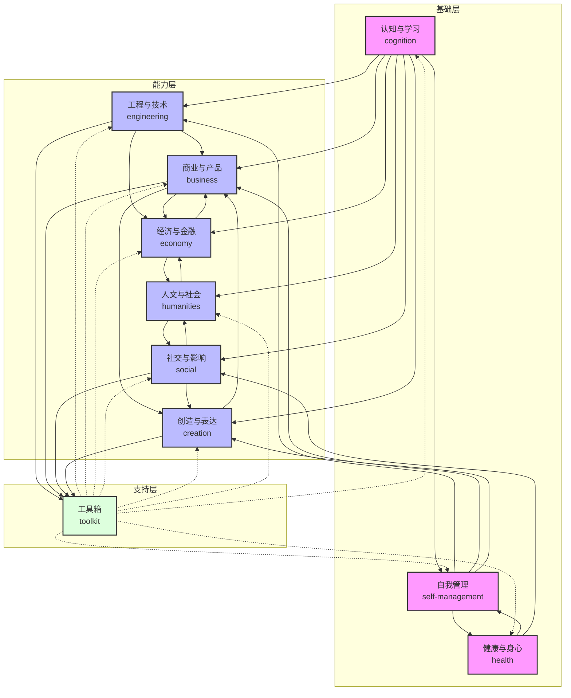

# 人生进化手册

> 一份面向个人长期成长的训练手册，帮助建立跨领域理解、判断、协作和创造的能力。

*元数据：最后更新 2026-07-04 | 版本 1.5*

---

## 目录

- [理念](#理念)
- [模块地图](#模块地图)
- [分类索引](#分类索引)
  - [按场景快速查找](#按场景快速查找)
  - [按输出类型查找](#按输出类型查找)
  - [按训练阶段查找](#按训练阶段查找)
- [快速开始（5 步）](#快速开始5-步)
- [学习原则](#学习原则)
- [三阶段路线](#三阶段路线)
- [每周训练模板](#每周训练模板)
- [衡量标准](#衡量标准)
- [常见问题 FAQ](#常见问题-faq)
- [更新日志](#更新日志)

---

## 理念

人生进化不是简单地学更多东西，而是让一个人持续提升**认知、行动、关系、创造和身心状态**。一个持续进化的人，通常具备以下能力：

- 能快速进入新领域，抓住关键概念、变量、约束和评价标准。
- 能把技术、商业、社会、经济、人性和表达连接起来，形成可执行判断。
- 能在不确定环境中做决策，设计试验，复盘结果，并持续修正。
- 能与专家合作，听懂专家语言，也能把复杂内容翻译给非专家。
- 能把知识沉淀为系统、流程、产品、文章、课程、组织能力或长期资产。

一句话：**从被动学习，转向主动创造。**

---

## 模块地图

| 模块 | 目标 | 文件 |
| --- | --- | --- |
| 认知与学习 | 建立底层学习力、判断力和系统思维 | [cognition.md](./cognition.md) |
| 工程与技术 | 理解需求、约束、系统、权衡、验证和交付 | [engineering.md](./engineering.md) |
| 商业与产品 | 理解价值创造、产品设计、增长和经营 | [business.md](./business.md) |
| 经济与金融 | 理解资源配置、周期、资产和风险 | [economy.md](./economy.md) |
| 社交与影响 | 提升沟通、谈判、协作、关系和情绪智能 | [social.md](./social.md) |
| 创造与表达 | 训练写作、演讲、审美、内容和作品输出 | [creation.md](./creation.md) |
| 自我管理 | 建立目标、时间、精力、习惯和复盘系统 | [self-management.md](./self-management.md) |
| 健康与身心 | 维护身体、睡眠、运动、心理韧性 | [health.md](./health.md) |
| 人文与社会 | 理解历史、哲学、政治、文化和制度 | [humanities.md](./humanities.md) |
| 工具箱 | 提供可直接使用的模板、清单和训练方法 | [toolkit.md](./toolkit.md) |

### 模块关系图

**图例**：箭头表示知识依赖和推荐学习顺序。基础层模块建议优先学习，能力层模块可并行推进，支持层为所有模块提供工具和模板。

---

## 分类索引

### 按场景快速查找

| 场景 | 相关模块 |
| --- | --- |
| **想学习一个新领域** | [认知与学习](./cognition.md)、[工程与技术](./engineering.md) |
| **想解决问题、做决策** | [工程与技术](./engineering.md)、[工具箱-问题定义卡](./toolkit.md#问题定义卡) |
| **想做项目、建系统** | [工程与技术](./engineering.md)、[自我管理](./self-management.md) |
| **想做产品、创业** | [商业与产品](./business.md)、[工程与技术](./engineering.md) |
| **想提升表达、写作** | [创造与表达](./creation.md)、[社交与影响](./social.md) |
| **想管理人脉、建立协作** | [社交与影响](./social.md)、[商业与产品](./business.md) |
| **想理解经济、商业** | [经济与金融](./economy.md)、[商业与产品](./business.md) |
| **想理解社会、历史** | [人文与社会](./humanities.md)、[经济与金融](./economy.md) |
| **想管理健康、精力** | [健康与身心](./health.md)、[自我管理](./self-management.md) |
| **想要模板、清单** | [工具箱](./toolkit.md) |

### 按输出类型查找

| 输出类型 | 相关模块 |
| --- | --- |
| **文章、笔记、文档** | [认知与学习](./cognition.md)、[创造与表达](./creation.md)、[工具箱-学习输出模板](./toolkit.md#学习输出模板) |
| **产品、原型、MVP** | [工程与技术](./engineering.md)、[商业与产品](./business.md) |
| **演讲、表达** | [创造与表达](./creation.md)、[社交与影响](./social.md) |
| **决策、方案** | [工程与技术](./engineering.md)、[经济与金融](./economy.md)、[工具箱-决策记录](./toolkit.md#决策记录) |
| **研究报告** | [人文与社会](./humanities.md)、[经济与金融](./economy.md) |
| **个人系统、流程** | [自我管理](./self-management.md)、[工程与技术](./engineering.md) |

### 按训练阶段查找

| 阶段 | 推荐模块 |
| --- | --- |
| **第一阶段（0-3 个月）打基础** | [认知与学习](./cognition.md)、[自我管理](./self-management.md)、[工具箱](./toolkit.md) |
| **第二阶段（3-12 个月）跨域组合** | [工程与技术](./engineering.md)、[商业与产品](./business.md)、[创造与表达](./creation.md) |
| **第三阶段（1-3 年）系统创造** | [经济与金融](./economy.md)、[人文与社会](./humanities.md)、[社交与影响](./social.md) |

---

## 快速开始（5 步）

1. **填写能力自评表** ——打开 [toolkit.md](./toolkit.md#能力自评表)，诚实给自己打分。
2. **选择季度主题** ——从 10 个模块中挑 2-3 个作为当前季度训练主线。
3. **制定行动方案** ——使用 [问题定义卡](./toolkit.md#问题定义卡) 写一份季度计划。
4. **每周训练** ——按照下方 [每周训练模板](#每周训练模板) 的节奏推进。
5. **定期复盘** ——使用 [项目复盘表](./toolkit.md#项目复盘表) 回顾进展并调整。

---

## 学习原则

1. **以问题驱动学习**：先定义自己要解决的问题，再选择知识，不把学习变成收藏。
2. **以输出检验理解**：每个主题都要产出文章、图表、项目、演讲、决策或流程。
3. **建立最小可用知识**：先掌握核心概念、经典框架、常见错误和实践入口。
4. **交替使用广度与深度**：广度用于建立连接，深度用于形成可信能力。
5. **用真实项目训练**：能力必须在现实约束中长出来，而不是只停留在概念层。
6. **周期性复盘**：每周复盘行动，每月复盘能力，每季度复盘方向。

---

## 三阶段路线

### 第一阶段：基础能力（0-3 个月）

目标是建立稳定的学习和输出系统。

- 每天阅读 30-60 分钟，覆盖技术、商业、经济、人文四类内容。
- 每周写一篇 1000 字以上的主题笔记。
- 每周做一次复盘，记录输入、输出、行动和错误。
- 学会使用信息管理、任务管理、AI 工具、表格和基础自动化。
- 完成一个小项目，例如个人知识库、自动化脚本、行业研究报告或公开演讲。

### 第二阶段：跨域组合（3-12 个月）

目标是把知识变成解决问题的能力。

- 选择一个主领域深挖，例如 AI 产品、投资研究、组织管理、内容创业或城市研究。
- 每月完成一个可展示作品，例如产品原型、研究报告、课程、工具、访谈集。
- 建立 3-5 个专家或同行连接，定期交流和校准认知。
- 学习基本财务、市场、技术架构、用户研究和谈判能力。
- 开始用真实反馈修正自己的判断，而不是只靠自我感觉。

### 第三阶段：系统创造（1-3 年）

目标是形成个人方法论和可复用系统。

- 在一个真实领域形成稳定判断力和作品积累。
- 能独立设计项目、组建协作、配置资源、控制风险。
- 将经验沉淀为手册、课程、产品、工具、流程或组织机制。
- 建立个人声誉：让别人知道你在哪些问题上可信。
- 从「学习很多东西」转向「用多学科能力创造稀缺价值」。

---

## 每周训练模板

| 时间 | 训练内容 | 输出 |
| --- | --- | --- |
| 周一 | 选择一个问题，列出已知和未知 | 问题定义卡 |
| 周二 | 阅读和调研核心资料 | 资料摘要 |
| 周三 | 建立框架、画图、做假设 | 思维导图或结构图 |
| 周四 | 与人讨论、访谈、请教专家 | 访谈记录 |
| 周五 | 做一个小实验或原型 | 实验结果 |
| 周六 | 写作、演讲或公开发布 | 文章、视频、演示 |
| 周日 | 复盘和下周计划 | 复盘表 |

---

## 衡量标准

不要用「学了多少」衡量自己，而要用以下指标：

- 能否用 5 分钟讲清一个复杂问题。
- 能否指出一个领域的核心变量和主要争议。
- 能否把抽象知识转化为行动步骤。
- 能否和专家交流 30 分钟而不偏离重点。
- 能否做出一个真实可用的作品。
- 能否在反馈后修正观点，而不是维护面子。
- 能否持续一年稳定输出和复盘。

---

## 常见问题 FAQ

### Q1: 这个手册适合什么人？
适合任何想系统性提升自己的人，尤其是：
- 感觉自己学了很多但用不出来的人
- 想跨领域发展、建立综合能力的人
- 希望把知识变成作品和资产的人
- 处于人生转折点、想重新规划方向的人

### Q2: 应该从哪个模块开始？
推荐路径：
1. **基础层**：先读 [认知与学习](./cognition.md) 和 [自我管理](./self-management.md)，建立学习和行动的基础
2. **工具箱**：同时打开 [工具箱](./toolkit.md)，边学边用模板练习
3. **能力层**：根据你的目标选择 2-3 个模块深入，例如想做产品就读商业+工程，想做内容就读创造+社交

### Q3: 多久能看到效果？
- **2-4 周**：能感受到学习方法和时间管理的变化
- **3 个月**：能形成稳定的输出习惯和基础判断力
- **1 年以上**：能看到跨领域组合能力和作品积累

关键不是读得快，而是**边学边练、持续输出**。

### Q4: 需要把所有模块都学完吗？
不需要。人生进化不是考试，不需要满分。建议：
- 先选 2-3 个和你当前目标最相关的模块
- 每个模块挑 2-3 个实践任务去做
- 遇到问题时再回来找对应的方法和工具

### Q5: 如何判断自己有没有进步？
不要用「读了多少书」衡量，而是用：
- 能否解决以前解决不了的问题
- 能否把复杂问题讲清楚
- 能否持续产出作品和成果
- 能否在反馈后调整自己的判断

可以使用 [能力自评表](./toolkit.md#能力自评表) 每季度评估一次。

### Q6: 工作太忙，没时间学怎么办？
- 从每天 15 分钟开始，比完全不做好
- 用通勤、排队等碎片时间听音频或思考
- 把工作本身当训练：每做一个项目都复盘提炼
- 优先学习能直接用在当前工作上的内容

---

## 更新日志

### v1.5 (2026-07-04)

- 认知模块新增 12 种常见认知偏差及应对方法
- 认知模块新增决策框架：10 项决策检查清单 + 简单决策矩阵
- 工程模块新增项目风险管理（6 类风险 + 4 种应对策略）
- 工程模块新增敏捷开发入门（Scrum 框架 + 迭代周期建议）
- 自我管理模块新增个人 OKR 设定方法
- 自我管理模块新增精力管理（四维度 + 每日节奏 + 恢复方法）
- 商业模块新增 6 种定价方法和三层定价设计
- 商业模块新增竞争分析框架（波特五力模型 + 4 种竞争定位）
- 创造与表达模块新增选题方法（3 大来源 + 判断标准 + 储备方法）
- 创造与表达模块新增内容生产系统（7 步工作流 + 写作障碍破解 + 内容复用）
- 工具箱新增决策记录模板和年度规划模板
- 所有模块版本统一升级到 v1.5

### v1.4 (2026-06-30)

- 认知模块新增信息源分级（A-E 五级评价体系）
- 认知模块新增高效学习方法：费曼技巧 5 步法 + 间隔重复时间表
- 工程模块新增 8 种常见设计模式和 5 种常见反模式
- 自我管理模块新增习惯系统设计（习惯公式、6 种降摩擦方法、4 个常见陷阱）
- 健康模块新增新手 8 周运动启动计划
- 社交模块新增会议效率指南和反馈技巧（给反馈/接受反馈/反馈频率）
- 商业模块新增增长策略框架（三阶段策略 + AARRR 漏斗模型）
- 所有模块版本统一升级到 v1.4

### v1.3 (2026-06-30)

- 经济模块新增资产配置入门（资产类别对比、配置原则、新手推荐配置）
- 创造与表达模块新增 6 种常用写作框架和好标题的 5 个原则
- 创造与表达模块新增经典演讲结构和演讲准备检查清单
- 人文模块新增重要概念词典（8 个核心概念及代表思想家）
- 人文模块新增推荐入门书单（历史/哲学/政治社会/文化思想 四个层级）
- 工具箱新增阅读清单模板、技能成长追踪表、每周复盘模板
- README 新增常见问题 FAQ（6 个高频问题）
- 所有模块版本统一升级到 v1.3

### v1.2 (2026-06-27)

- 统一所有模块的版本号和更新日期
- 补充工具箱中领域入门地图、访谈提纲、周计划模板的 JSON/YAML 格式版本
- 工具箱新增时间审计表和个人资产负债表模板
- 修复 30 天训练营复选框符号（未完成 ☐ / 已完成 ☑）
- README 新增更新日志章节
- 认知模块新增 5 个思维模型：奥卡姆剃刀、帕累托法则、沉没成本谬误、机会成本、证实偏差
- 工程模块新增优先级判断框架
- 自我管理模块新增时间分类法
- 健康模块新增睡眠质量检查清单
- 商业模块新增单位经济模型详解
- 社交模块新增沟通的 7 个习惯

### v1.1 (2026-06-20)

- 新增模块关系图（Mermaid）
- 新增分类索引（按场景、输出类型、训练阶段）
- 优化快速开始流程
- 完善各模块核心能力描述

### v1.0 (2026-06-15)

- 初始版本发布
- 包含 10 个核心模块：认知、工程、商业、经济、社交、创造、自我管理、健康、人文、工具箱
- 提供 9 个可直接使用的模板和清单
- 包含 30 天人生进化训练营计划
